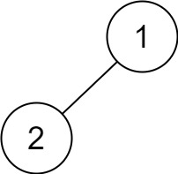

# 145.Binary Tree Postorder Traversal 
Given the root of a binary tree, return the postorder traversal of its nodes' values.

### Example 1:

``` 
Input: root = [1,null,2,3]
Output: [3,2,1]
```
### Example 2:
``` 
Input: root = []
Output: []
```
### Example 3:
``` 
Input: root = [1]
Output: [1]
```
### Example 4:

``` 
Input: root = [1,2]
Output: [2,1]
```
### Example 5:

``` 
Input: root = [1,null,2]
Output: [2,1]
```