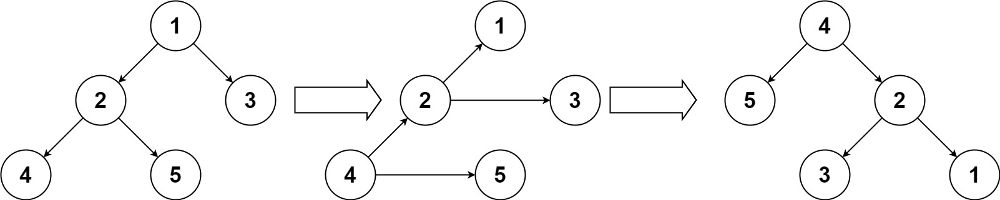

# 156.Binary Tree Upside Down
Given the root of a binary tree, turn the tree upside down and return the new root.

You can turn a binary tree upside down with the following steps:

1. The original left child becomes the new root.
2. The original root becomes the new right child.
3. The original right child becomes the new left child.

   
The mentioned steps are done level by level, it is **guaranteed** that every node in the given tree has either **0 or 2 children**.

### Example 1:

``` 
Input: root = [1,2,3,4,5]
Output: [4,5,2,null,null,3,1]
```
### Example 2:
``` 
Input: root = []
Output: []
```
### Example 3:
``` 
Input: root = [1]
Output: [1]
```