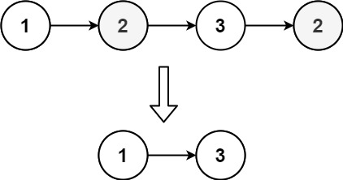
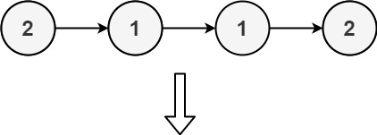
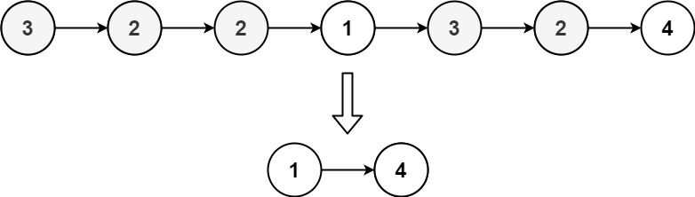

# 1836.Remove Duplicates From an Unsorted Linked List
Given the head of a linked list, find all the values that appear **more than once** in the list and delete the nodes that have any of those values.

Return the linked list after the deletions.
### Example 1:

``` 
Input: head = [1,2,3,2]
Output: [1,3]
Explanation: 2 appears twice in the linked list, so all 2's should be deleted. After deleting all 2's, we are left with [1,3].

```
### Example 2:

``` 
Input: head = [2,1,1,2]
Output: []
Explanation: 2 and 1 both appear twice. All the elements should be deleted.

```
### Example 3:

``` 
Input: head = [3,2,2,1,3,2,4]
Output: [1,4]
Explanation: 3 appears twice and 2 appears three times. After deleting all 3's and 2's, we are left with [1,4].

```