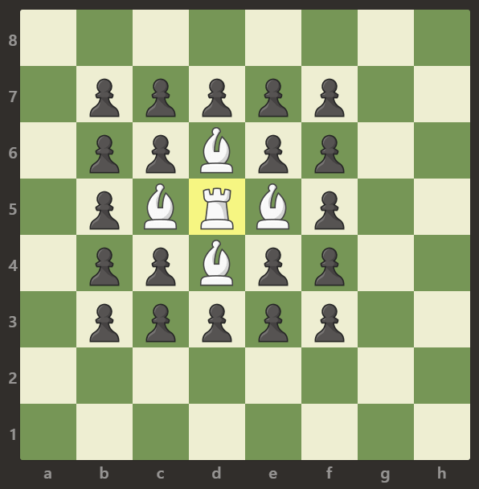

# 999.Available Captures for Rook 
On an 8 x 8 chessboard, there is **exactly one** white rook 'R' and some number of white bishops 'B', black pawns 'p', and empty squares '.'.

When the rook moves, it chooses one of four cardinal directions (north, east, south, or west), then moves in that direction until it chooses to stop, reaches the edge of the board, captures a black pawn, or is blocked by a white bishop. A rook is considered **attacking** a pawn if the rook can capture the pawn on the rook's turn. **The number of available captures** for the white rook is the number of pawns that the rook is **attacking**.

Return the **number of available captures** for the white rook.

### Example 1:

``` 
Input: board = [[".",".",".",".",".",".",".","."],[".",".",".","p",".",".",".","."],[".",".",".","R",".",".",".","p"],[".",".",".",".",".",".",".","."],[".",".",".",".",".",".",".","."],[".",".",".","p",".",".",".","."],[".",".",".",".",".",".",".","."],[".",".",".",".",".",".",".","."]]
Output: 3
Explanation: In this example, the rook is attacking all the pawns.
```
### Example 2:

``` 
Input: board = [[".",".",".",".",".",".",".","."],[".","p","p","p","p","p",".","."],[".","p","p","B","p","p",".","."],[".","p","B","R","B","p",".","."],[".","p","p","B","p","p",".","."],[".","p","p","p","p","p",".","."],[".",".",".",".",".",".",".","."],[".",".",".",".",".",".",".","."]]
Output: 0
Explanation: The bishops are blocking the rook from attacking any of the pawns.
```
### Example 3:

``` 
Input: board = [[".",".",".",".",".",".",".","."],[".",".",".","p",".",".",".","."],[".",".",".","p",".",".",".","."],["p","p",".","R",".","p","B","."],[".",".",".",".",".",".",".","."],[".",".",".","B",".",".",".","."],[".",".",".","p",".",".",".","."],[".",".",".",".",".",".",".","."]]
Output: 3
Explanation: The rook is attacking the pawns at positions b5, d6, and f5.
```